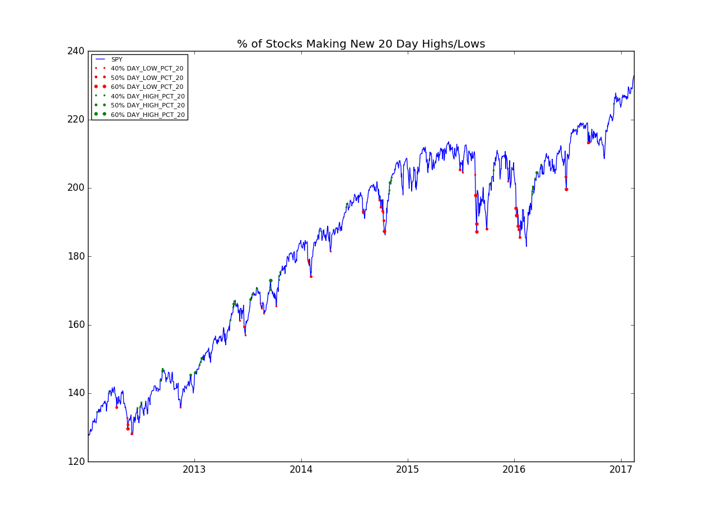
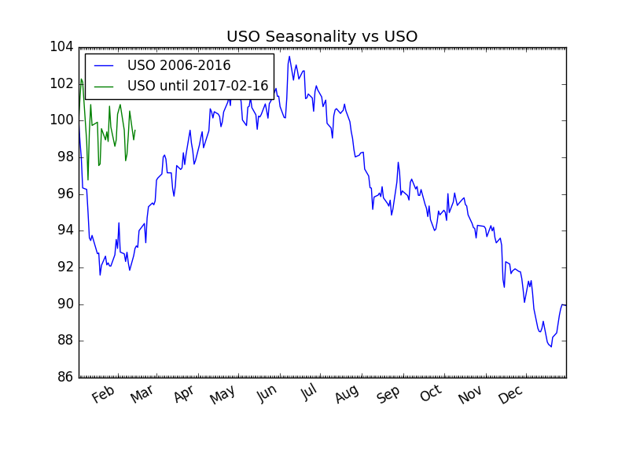

## Quantitative Analysis tools

Analyze and plot market breadth, seasonality, etc.


## Installation
* pandas, matplotlib, etc.
* https://github.com/fbjarkes/dataprovider.git

Install required libraries in virtualenv.

#TODO: install in another way??
### Install libraries
```
$ git clone https://github.com/fbjarkes/dataprovider.git
$ virtualenv -p python3 . && source bin/activate
$ pip install -r dataprovider/requirements.txt
$ python dataprovider/setup.py install 
```

### Install 
```
$ git clone https://github.com/fbjarkes/qa_tools.git
$ pip install -r dataprovider/requirements.txt

$ pip install -r qa_tools/requirements.txt
$ cd qa_tools
```

## Market breadth analysis
```
Usage: market_breadth.py <options> <function> <lookback>

  Tool for analyzing and plotting market internals

  <lookback>: Integer to specify lookback period

  <function>: Available analysis methods

  'hilo': to calculate all stocks making new daily highs/lows.

  'dma': calculate all stocks below/above any moving average.

Options:
  --start TEXT               starting date.
  --end TEXT                 ending date
  --tickers TEXT             Comma separated list of tickers
  --file PATH                Read tickers from file
  --provider [yahoo|google]
  --quotes                   Add intraday (possibly delayed) quotes, e.g. for
                             analyzing during market opening hours
  --plot-vs TEXT             Which Stock/ETF to visualize breadth, e.g. 'SPY'
  --plot-pct-levels TEXT     Comma separated list, e.g. '20,30' to visulize
                             when 20% and 30% of stocks making 20-Day
                             highs/lows
  --help                     Show this message and exit.
```

##### Examples:

1. 20-Day Highs/Lows breadth: 
    Plot market breadth with 'hilo' function, i.e. all stocks in sp500.txt making new 20-Day highs/lows:
    ```
    $ python3 market_breadth.py --start 2010-01-01 --file sp500.txt hilo 20 --provider=yahoo --plot-vs=SPY --plot-pct-levels=40,50,60
    ```
    
    
    Note: this function takes approx. 20min to run on a MacBook Pro, 2.2Ghz, Mid-2014


2. Above/below 200DMA breadth: 
    Plot market breadth with 'dma' function, i.e. all stocks below or above 200DMA:
    ```
    $ python3 market_breadth.py --start 2005-01-01 --file sp500.txt dma 200 --provider=google --plot-vs=SPY --plot-pct-levels=50,75,90
    ```
    


3. Current realtime (possibly delayed) 50-Day Highs/Lows:
    
    Note: start date of analysis should include more tradingdays than lookback period
    ```
    $ python3 market_breadth.py --start 2016-11-01 --file=sp500.txt hilo 50 --provider=google --quotes
                DAY_HIGH_50  DAY_HIGH_PCT_50  DAY_LOW_50  DAY_LOW_PCT_50
    ...
    2017-02-01         42.0         8.624230        39.0        8.008214
    2017-02-02         46.0         9.445585        23.0        4.722793
    2017-02-03         76.0        15.605749         6.0        1.232033
    2017-02-04          0.0         0.000000         0.0        0.000000
    2017-02-05          0.0         0.000000         0.0        0.000000
    2017-02-06         33.0         6.776181        14.0        2.874743
    2017-02-07         59.0        12.114990        31.0        6.365503
    2017-02-08          0.0         0.000000         0.0        0.000000
    
    ```
    
## Sesonality
```
Usage: seasonality.py <options>

Options:
  --start TEXT                 Starting year, e.g. '2005-01-01'
  --end TEXT                   Ending year, e.g. '2015-12-31'
  --ticker TEXT                Ticker to analyze, e.g. 'SPY'
  --provider [yahoo|google]
  --plot-vs TEXT               Which Stock/ETF to visualize in same plot, e.g.
                               'SPY'
  --monthly                    Subplot seasonality per month
  --plot-label [day|calendar]  Label for x-axis. Use 'Day' for trading day of
                               year
  --help                       Show this message and exit
```
##### Examples
1. Plot SPY vs. the seasonlity using trading days as labels: 
    ```
    $ python3 seasonality.py --provider yahoo --start 2005-01-01 --end 2016-12-31 --ticker SPY --plot-vs SPY --plot-label day
    ```
    
    
2. Plot USO vs the seasonality using calendar labels:
    ```
    $ python3 seasonality.py --provider=yahoo --start 2005-01-01 --end 2016-12-31 --ticker USO --plot-vs USO --plot-label month
    ```
    
    
3. Plot seasonality per month:
    ```
    $  python3 seasonality.py --start 2005-01-01 --end 2015-12-31 --ticker SPY --monthly
    ```
    
        
        
#### TODO:
* Additional breadth/internal indicators
* Detailed analysis/plot of Bollinger breakout strategies 
* Support for OMXS30 (Swedish) stocks
* Fixes/Optimizations