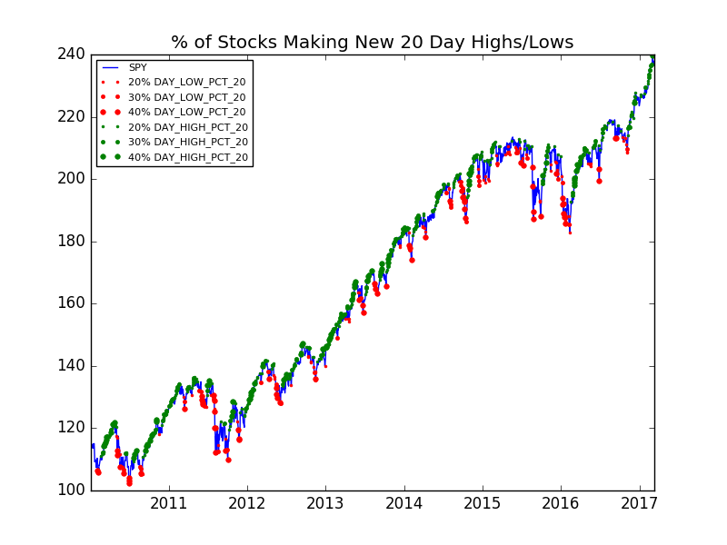

## Quantitative Analysis tools

Analyze and plot market breadth, seasonality, strategy/portfolio analysis, etc.

## Python requirements 
* python3
* setuptools
* pip
* virtualenv
* pandas, matplotlib, pyts, etc. (from requirements.txt)
* wrapper for pandas-datareader (https://github.com/fbjarkes/dataprovider.git)

## Installation
### Install tools and required libraries
1. Init virtual environment:
```
$ virtualenv .
$ source bin/activate
```
2. Install the dataprovider-library from git: 
```
$ git clone https://github.com/fbjarkes/dataprovider.git
$ pip install -r dataprovider/requirements.txt
$ cd dataprovider && python setup.py install && cd ..
```
3. Clone repository:
```
$ git clone https://github.com/fbjarkes/qa_tools.git
$ pip install -r qa_tools/requirements.txt
```
4. Possibly needed before invoking scripts in qa_tools:
```
$ export LC_ALL=en_US.UTF-8 LANG=en_US.UTF-8
```

## Market breadth analysis
```
Usage: market_breadth.py <options> <function> <lookback>

  Tool for analyzing and plotting market internals

  <lookback>: Integer to specify lookback period

  <function>: Available analysis methods

  'hilo': to calculate all stocks making new daily highs/lows.

  'dma': calculate all stocks below/above any moving average.

Options:
  --start TEXT               starting date.
  --end TEXT                 ending date
  --tickers TEXT             Comma separated list of tickers
  --file PATH                Read tickers from file
  --provider [yahoo|google]
  --quotes                   Add intraday (possibly delayed) quotes, e.g. for
                             analyzing during market opening hours
  --plot-vs TEXT             Which Stock/ETF to visualize breadth, e.g. 'SPY'
  --plot-pct-levels TEXT     Comma separated list, e.g. '20,30' to visulize
                             when 20% and 30% of stocks making 20-Day
                             highs/lows
  --help                     Show this message and exit.
```

##### Examples:

1. 20-Day Highs/Lows breadth: 
    Plot market breadth with 'hilo' function, i.e. all stocks in sp500.txt making new 20-Day highs/lows:
    ```
    $ ./market_breadth.py --start 2010-01-01 --file sp500.txt hilo 20 --provider=yahoo --plot-vs=SPY --plot-pct-levels=30,40,50
    ```
    
    
    Note: this function takes approx. 20min to run on a MacBook Pro, 2.2Ghz, Mid-2014


2. Above/below 200DMA breadth: 
    Plot market breadth with 'dma' function, i.e. all stocks below or above 200DMA:
    ```
    $ ./market_breadth.py --start 2005-01-01 --file sp500.txt dma 200 --provider=google --plot-vs=SPY --plot-pct-levels=50,75,90
    ```
    


3. Current realtime (possibly delayed) 50-Day Highs/Lows:
    
    Note: start date of analysis should include more tradingdays than lookback period
    ```
    $ ./market_breadth.py --start 2016-11-01 --file=sp500.txt hilo 50 --provider=google --quotes
                DAY_HIGH_50  DAY_HIGH_PCT_50  DAY_LOW_50  DAY_LOW_PCT_50
    ...
    2017-02-01         42.0         8.624230        39.0        8.008214
    2017-02-02         46.0         9.445585        23.0        4.722793
    2017-02-03         76.0        15.605749         6.0        1.232033
    2017-02-04          0.0         0.000000         0.0        0.000000
    2017-02-05          0.0         0.000000         0.0        0.000000
    2017-02-06         33.0         6.776181        14.0        2.874743
    2017-02-07         59.0        12.114990        31.0        6.365503
    2017-02-08          0.0         0.000000         0.0        0.000000
    
    ```
    
## Sesonality
```
Usage: seasonality.py <options>

Options:
  --start TEXT                 Starting year, e.g. '2005-01-01'
  --end TEXT                   Ending year, e.g. '2015-12-31'
  --ticker TEXT                Ticker to analyze, e.g. 'SPY'
  --provider [yahoo|google]
  --plot-vs TEXT               Which Stock/ETF to visualize in same plot, e.g.
                               'SPY'
  --monthly                    Subplot seasonality per month
  --plot-label [day|calendar]  Label for x-axis. Use 'Day' for trading day of
                               year
  --help                       Show this message and exit
```
##### Examples
1. Plot SPY vs. the seasonlity using trading days as labels: 
    ```
    $ ./seasonality_analysis.py --provider yahoo --start 2005-01-01 --end 2016-12-31 --ticker SPY --plot-vs SPY --plot-label day
    ```
    
    
2. Plot OMXS30 vs the seasonality using calendar labels:
    ```
    $ ./seasonality_analysis.py --start 2005-01-01 --end 2016-12-31 --plot-vs ^OMX --ticker ^OMX --provider yahoo
    ```
    
    
3. Plot seasonality per month:
    ```
    $  ./seasonality.py --start 2005-01-01 --end 2015-12-31 --ticker SPY --monthly
    ```
    
        
       
## Monte Carlo Analysis
```
Usage: monte_carlo_analysis.py [OPTIONS]

  Command line tool for simulating equity curves.

Options:
  --prob-win FLOAT       Probability for winning trade, e.g. 0.65 for 65%
                         [required]
  --profit-avg FLOAT     The average profit, e.g. "100" for $100  [required]
  --loss-avg FLOAT       The average loss, e.g. "50" for -$50  [required]
  --trades INTEGER       Number of trades used in simulations
  --equity INTEGER       Starting equity, e.g 10000 for $10000
  --risk FLOAT           Percent of portfolio to risk, e.g. 0.02 for 2%. If 0
                         use kelly sizing
  --dynamic-size         Add profits/losses cumulatively to equity and
                         increase position size
  --simulations INTEGER  Number of simulations, e.g. 10
  --plot                 Plot equity curves
  --help                 Show this message and exit.
```
##### Examples
1. 100 Monte Carlo simulations with 1000 trades using Kelly position size (W – ((1 – W) / R)):
    ```
    $ ./monte_carlo_analysis.py --prob-win 0.55 --profit-avg 100 --loss-avg 100 --trades 1000 --equity 10000 --simulations 100 --plot
    Running 100 simulations with 10.0% risk (Kelly size) of 10000 starting equity.
    P_win=0.55, Avg.Profit=100.0, Avg.Loss=100.0
    Min equity: 0
    Max equity: 190000.1
    Performance avg: 975.6%
    Max Drawdown: 111.11%
    Average Max Drawdown: 52.54%
    Risk of ruin: 4.0%
    ```
    
    

## Combined Returns
```
```

##### Examples
1. TODO: Combine Telecom companies (TEL2-B, TELIA,...)
    ```
    $ ./combined_returns.py --tickers TEL2-B.ST, TELIA.ST --start 2005-01-01 --ta DMA --ta-param 200
    ```